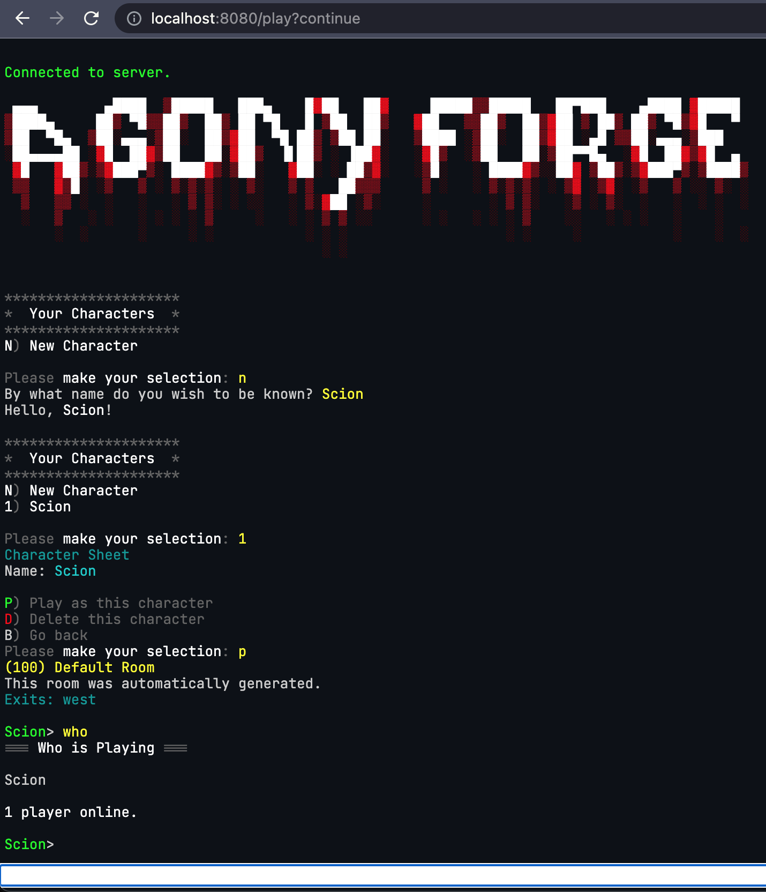

[](https://discord.gg/6DHKrMJCJE)

# Agony Forge
**An open source MUD.**  
Agony Forge is a web based Multi User Domain, or MUD. It is written using Java and Spring Boot using modern security and technology to provide an experience that feels like a telnet session from the 90s in your browser.

## Core Module
The core module in Agony Forge provides a lightweight framework that handles security, session management, server clustering, and WebSocket transport for connections between players' browsers and the MUD server. It also provides a small set of standard objects and utilities to use as a platform for building a game.

The core module provides these functionalities:
* Low level management for network connections
* Framework for interpreting user commands
* Customizable menu framework
* Timer events
* Messaging from server to players
* Interpretation of color codes
* Flexible dice rolling
  
## Agony Forge MUD
The second module is the MUD. It uses the core module and builds a game around them. It is also where new core features are incubated and developed before they get extracted back into the core module.

Here is where you will find:
* Rooms, Objects and Mobs
* Commands, menus and in-game editors
* Persistence of objects to the database

## Quick Start

```bash
$ git clone git@github.com:scionaltera/agonyforge.git
$ cd agonyforge
$ cp mud.EXAMPLE.env mud.env
# set up an OAuth2 application in GitHub
# add GitHub details to mud.env, see wiki for details!
$ ./gradlew clean build
$ docker-compose up
# go to http://localhost:8080 to see the MUD!
```

Please check the [Wiki](https://github.com/scionaltera/agonyforge/wiki/How-to-Develop) for more detailed setup instructions. If you get stuck, feel free to ask for help in the GitHub Discussions on our Discord by clicking the badge at the top of this README.


